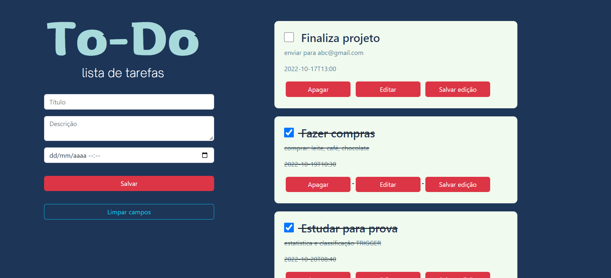
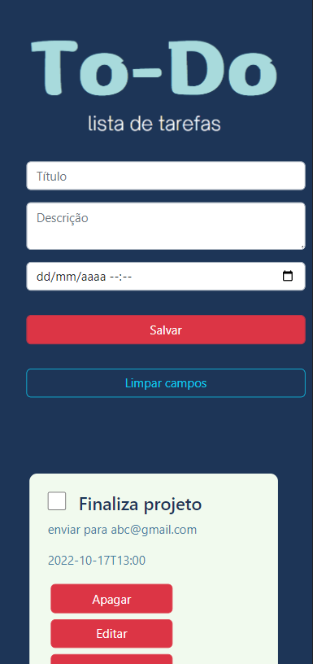

# Lista de Tarefas
#### A aplicação permite que o usuário cadastre tarefas com título, descrição e data, podendo também editar, marcar como concluído e excluir. As tarefas ficam salvas no LocalStorage, protanto é possivel fechar a janela do navegador e abri-la novamente sem perder nada!

### Tecnologias utilizadas:
- HTML
- css
- Bootstrap
- JavaScript

#### Preview do projeto:

Desktop

Mobile
